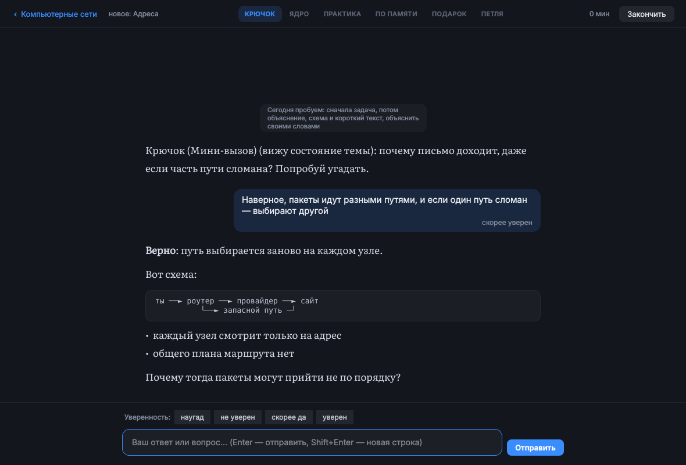

# Наставник

Учёба с Claude для Ubuntu, которая подстраивается под вас. Работает как рекомендации YouTube, только цель другая: не время в приложении, а то, что вы помните через неделю. Отдельно есть «Разговор», где можно выговориться.



## Установка

```bash
git clone -b claude/serene-turing-9tgc9t https://github.com/thefounderofmoneta/stoic.git
cd stoic/nastavnik
./install.sh
```

Что делает установщик:
- ставит недостающие системные пакеты (`python3-venv`, `libxcb-cursor0`, `libnotify-bin` и пару библиотек Qt);
- создаёт окружение Python в `.venv`;
- добавляет команду `nastavnik` и ярлык «Наставник» в меню приложений;
- проверяет Claude Code и, если нужно, предлагает установить его и войти в аккаунт;
- ставит таймер systemd на ежедневное напоминание.

Повторный запуск `./install.sh` обновляет установку. `./uninstall.sh` удаляет приложение, а ваши данные — только если вы согласитесь.

Нужны Ubuntu 22.04 или новее, Python 3.10+ и подписка Claude. Ключ API не нужен: всё идёт через Claude Code (`claude -p`) по вашей подписке.

## Как пользоваться

При первом запуске мастер из четырёх шагов проверит вход в Claude, спросит об интересах, предложит время напоминания и первую тему.

- **Учёба.** Напишите, что хотите изучить и зачем. Claude составит карту темы: 6–14 понятий в порядке изучения, она видна схемой. Каждая сессия идёт по одному шаблону: **крючок-вопрос → ядро → практика → по памяти → подарок → вопрос на следующий раз**. Уверенность в ответе отмечается кнопками над полем ввода (`Alt+1…4`).
- **Повторение.** Карточки, которые Claude сделал в сессиях, возвращаются, когда вы вот-вот их забудете. Работает без Claude и не тратит лимиты: вспомнить → `Пробел` → честная оценка `1–4`.
- **Главная** отвечает на вопрос «что сейчас»: на чём вы остановились, план на сегодня и одна кнопка.
- **Прогресс** показывает всё, что система о вас узнала, и на чём это основано.
- **Разговор.** Три режима: «Просто выслушай», «Помоги разобраться», «Что делать». Режим можно сменить посреди разговора. Самочувствие отмечается в начале и в конце. Переписка по умолчанию удаляется. Короткую сводку для памяти вы видите целиком и сами решаете, запоминать ли её.

## Что подстраивается и почему

Решения взяты из анализа исследований (подробности — в [docs/DESIGN.md](docs/DESIGN.md)). Подстраивается только то, где люди действительно различаются и где результат можно измерить. Остальное берётся из исследований как есть.

| Что | Как | По чему судит |
|---|---|---|
| Когда повторять | FSRS-5, после 100 повторений — личный множитель памяти | Вспомнили или нет |
| Порядок, подача, закрепление | Бандит (выборка Томпсона) отдельно для понятий и процедур, 15 % сессий — разведка | **Отложенный тест** через 1,5+ дня, а не «понравилось» |
| Крючок и подарок | Тот же бандит | Оценка сессии 4–5 из 5 |
| Сложность | Claude держит 80–90 % верных: три лёгких подряд — усложнить, две ошибки — разобранный пример | Ответы в сессии |
| Длина сессии | Точка, после которой у вас падает точность | Точность по минутам сессии |
| План дня | Ваши минуты на карточку и на понятие, время сессии. Тяжёлый день — вдвое короче, после пропуска — 5 минут на возврат | Время и пропуски |
| Напоминание | Только если сегодня не занимались. Вопрос, на котором остановились, служит крючком | Напоминание |
| Примеры | Ваши интересы — в крючках, примерах и подарках | Профиль |

Мотивация считается тремя метриками отдельно:
- **тяга** — начали ли сами;
- **удовольствие** — оценка сессии;
- **польза** — отложенный тест.

Если две недели растёт только тяга, Прогресс об этом предупреждает, а подарки становятся сугубо информационными. Так приложение не превращается в игровой автомат. Наград-очков нет: ожидаемые награды подрывают интерес, а точная обратная связь его поддерживает.

«Разговор» отделён от учёбы. В нём нет серий, наград и напоминаний. Учёба видит из него только одно — был ли недавно тяжёлый момент, и тогда план становится короче. Содержание разговоров в учёбу не попадает.

## Контекст Claude не бесконечен

У каждой темы свой разговор с Claude: `claude -p --resume <id>` продолжается между сессиями. Карта, точки остановки, трудности и форматы хранятся в базе, а не в разговоре. Когда разговор становится больше лимита (по умолчанию 60 000 токенов, меняется в Настройках → Дополнительно), следующий ход начинает новый разговор с коротким «[состояние темы]» из базы. Ничего не теряется, а лимиты подписки тратятся меньше. Если старый разговор не найден (удалён, другой ПК), приложение само начинает новый так же. Системный промпт короткий и стабильный, поэтому кэш промптов Claude Code работает сам.

## Команды

```
nastavnik                  окно (--background — свёрнутым в значок панели)
nastavnik status           вход в Claude, серия, время за неделю, повторения на сегодня
nastavnik remind           напомнить сейчас (так же срабатывает таймер)
nastavnik export ФАЙЛ      всё об учёбе в JSON
nastavnik install-timer    поставить или обновить напоминание
```

## Данные и приватность

- Всё хранится локально: база в `~/.local/share/nastavnik` (с ежедневным бэкапом), настройки в `~/.config/nastavnik`.
- Claude-репетитор пишет в базу только через MCP-сервер приложения. У него нет ни команд, ни файлов.
- Время ответа и уверенность записывает окно, а не Claude.
- Сам разговор уходит в API Anthropic: так работает Claude.
- Журнал разговоров из «Разговора» в `~/.claude/projects/…` удаляется после завершения, если вы не включили хранение переписки.

## Разработка

```bash
.venv/bin/pip install -r requirements-dev.txt
QT_QPA_PLATFORM=offscreen .venv/bin/python -m pytest -q
```

42 теста:
- **ядро** — память, бандиты, план, серия, усталость, мотивация. Проверяется на симулированном ученике с известными свойствами: система должна их найти;
- **слой Claude** — поддельный `claude` (`tests/fakes/claude`) по-настоящему вызывает MCP-сервер, поэтому лимиты не тратятся;
- **сценарии окна** на виртуальном экране. Измеряемые проверки: окно не замирает дольше 250 мс, пока Claude печатает; Главная открывается быстрее 1,5 с с данными за год. Ломаем нарочно: испорченные настройки и база, истёкший вход, потерянный разговор.

Скриншоты всех экранов в тёмной и светлой теме лежат в `docs/screenshots/`.
