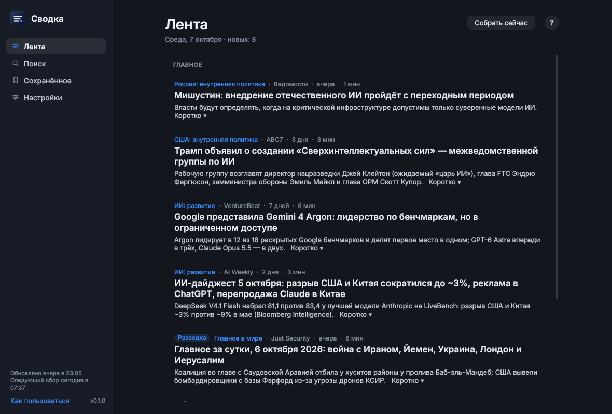
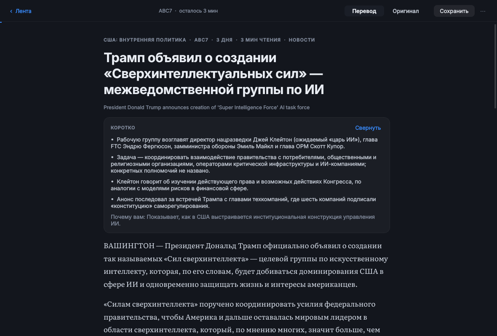

# Сводка

Личный поисковик новостей для Ubuntu. Утром и вечером Claude (по вашей подписке Pro, через Claude Code) ищет свежее по вашим темам, читает статьи и отбирает лучшее. «Сводка» складывает это в ленту, подстраивает порядок под вас, как рекомендации YouTube, и даёт читать статьи целиком по-русски.

| Лента | Читалка |
|---|---|
|  |  |

Скриншоты сняты с настоящего сбора: Claude нашёл, прочитал и перевёл эти статьи. Ещё: [поиск](docs/screenshots/search.png), [настройки](docs/screenshots/settings.png), [«Почему здесь»](docs/screenshots/explain.png), [мастер первого запуска](docs/screenshots/welcome.png).

## Установка

```bash
git clone -b claude/svodka https://github.com/thefounderofmoneta/stoic.git
cd stoic/svodka
./install.sh
```

Установщик:
- ставит недостающие системные пакеты (`python3-venv`, `libxcb-cursor0` и пару библиотек Qt);
- создаёт окружение Python в `.venv`;
- добавляет команду `svodka` и ярлык «Сводка» в меню приложений;
- проверяет Claude Code и, если нужно, предлагает установить его и войти в аккаунт;
- ставит таймер systemd на сбор утром и вечером.

Повторный запуск `./install.sh` обновляет установку. `./uninstall.sh` удаляет приложение. Ваши статьи и то, что лента о вас узнала, удаляются только с вашего согласия.

Нужны Ubuntu 22.04 или новее, Python 3.10+ и подписка Claude Pro (или выше). Ключ API не нужен.

## Как пользоваться

При первом запуске мастер из четырёх шагов проверит вход в Claude, покажет темы и профиль и соберёт первую ленту (3–6 минут). Дальше всё идёт само:

- **Лента.** В «Главном» пять лучших статей на сейчас, ниже — остальное свежее и прошлые дни. Наведите курсор на статью — появятся «Интересно», «Не моё» (с причиной), «Сохранить» и строка «Почему здесь». Значок **«Разведка»** отмечает темы, о которых вы не говорили: так лента ищет новые интересы. В ленту попадает только свежее — опубликованное за последние 3 дня, а Claude ищет прежде всего за последние сутки-полтора.
- **Читалка.** Полный перевод появляется абзац за абзацем. «EN» у абзаца показывает оригинал, а переключатель «Перевод / Оригинал» — всю статью. В конце статьи — реакции, иногда вопрос «Стоило времени?», «Спросить Claude» и «Похожее». Клавиши: `Esc` — назад, `O` — оригинал, `S` — сохранить, `L` / `D` / `F` — интересно / не моё / следить.
- **Поиск** ищет по библиотеке с учётом окончаний. Кнопка «Искать в интернете с Claude» находит, переводит и добавляет свежее. Запрос можно сохранить, и его будут проверять при каждом сборе.
- **Настройки** — темы («Реже / Обычно / Чаще»), профиль своими словами, расписание, вид, а в «Обучении ленты» видно, насколько лента вас понимает. Там же импорт интересов из Google.

Если ПК был выключен в плановое время, сбор пройдёт после включения. Если что-то сломалось (истёк вход, кончился лимит, нет сети), на Ленте появится баннер с кнопкой, которая это исправляет.

### Интересы из YouTube и поиска Google

У YouTube нет открытого доступа к истории и рекомендациям, поэтому «Сводка» использует Google Takeout:

1. Откройте [takeout.google.com](https://takeout.google.com) и выберите «YouTube и YouTube Music» (история и подписки) и «Мои действия» (поиск). Формат — JSON или HTML.
2. Когда Google пришлёт архив, нажмите Настройки → Обучение ленты → «Импорт из Google…» и выберите `.zip`.

Claude получит только названия видео, каналов и запросов за последний год. Из них он выведет стартовые интересы ленты и предложит обновить профиль и темы. Ничего не меняется без вашего подтверждения.

## Как лента учится

Каждая показанная статья получает оценку «ценности» по вашим действиям:

| Действие | Как влияет |
|---|---|
| Показ без действий | слабый минус, с поправкой на позицию: внизу ленты почти не считается |
| Открыл и сразу ушёл | минус источнику, похоже на кликбейт |
| Дочитал | плюс, по активному времени чтения и глубине прокрутки |
| Интересно, Круто, Сохранить, Следить, вопрос Claude | сильный плюс |
| Не моё, Уже знал, Поверхностно, Кликбейт | минус теме или источнику, в зависимости от причины |
| Опрос «Стоило времени?» | калибрует, как сильно доверять всем остальным сигналам |

Время чтения считается, только пока окно активно и вы недавно двигали мышью или нажимали клавиши.

Из этих оценок модель учит вкус по признакам статьи: тема, подтема, герои, источник, тип материала, длина. Используется линейный бандит с выборкой Томпсона, двумя памятями (долгой и «на этой неделе») и стартовыми знаниями из ваших тем и импорта Google.

Порядок ленты складывается из четырёх частей: ваш вкус, совпадение с профилем (оценка Claude), важность события и свежесть. Их веса лента подбирает сама по истории показов. В «Главном» не больше одной статьи на сюжет, и есть 1–2 места под разведку.

Всё это проверено на симулированном читателе (`tests/test_rank.py`). За 3–4 недели доля ценного в «Главном» растёт примерно с 0,32 (без подстройки) до 0,56. Лента находит скрытый интерес, о котором читатель не говорил, и перестраивается, когда интересы меняются.

Подробности — в [docs/DESIGN.md](docs/DESIGN.md).

## Команды

```
svodka                     окно (--background — свёрнутым в значок панели)
svodka collect [--force]   сбор сейчас
svodka search "запрос"     поиск в интернете с Claude
svodka status              вход в Claude, последний сбор, таймер
svodka import-takeout ZIP  интересы из Google Takeout
svodka weekly              еженедельный разбор профиля Claude
```

## Данные и приватность

Всё хранится локально: база в `~/.local/share/svodka`, настройки в `~/.config/svodka`. При сборе Claude получает темы, профиль, короткую сводку того, что вам нравится и не нравится, и заголовки нескольких недавних статей, которые зашли или не зашли. Полный журнал чтения и файлы с ПК ему не уходят. Тексты статей для Claude — данные, а не инструкции. Пейволы и капчи не обходятся.

## Разработка

```bash
.venv/bin/pip install -r requirements-dev.txt
QT_QPA_PLATFORM=offscreen .venv/bin/python -m pytest -q
```

Тесты используют поддельный `claude` (`tests/fakes/claude`) и локальный сайт, поэтому лимиты подписки они не тратят.
